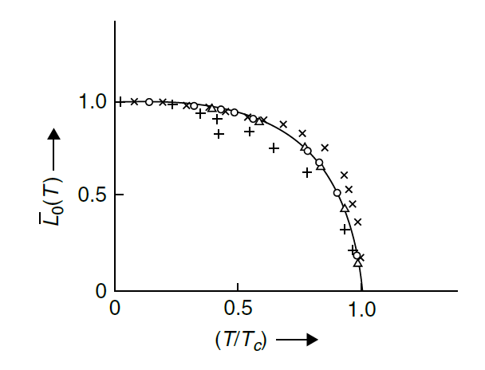
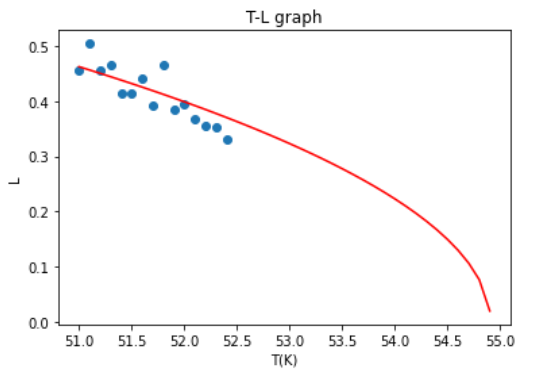
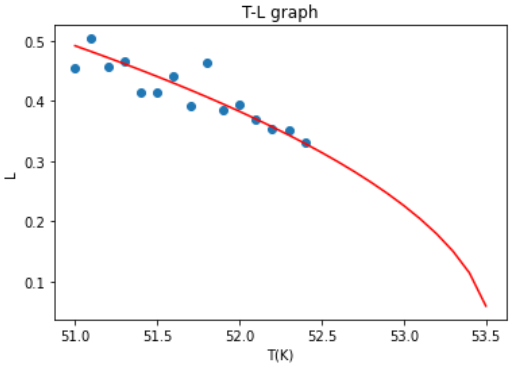

# 3D ising model simulation    - fitting data with 0th, 1st approximation
 3D ising model is simulated with c++ code. As we move the temperature, we try Monte Carlo simulation and get the magnetization for each temperature. 

## Assumptions
 * 3D lattice structure with size 1000 x 1000 x 1000.
 * 1000 iterations are enough to get to the MDP equilibrium. 
 * Checker board scanning is applied.
 * Periodic boundary condition is applied.
 
## Generate data
 Generate data with gen_magnetization.cpp  
 Monte carlo method(Metropolis) is used for getting to the equilibrium.  
 This file assumes that Curie temperature is at around 50 ~ 55K. 50 magnetization data are obtained for each temperature.
 

  
  * If you want to see roughly where Curie temperature shows up (as above), 
     
 
    run gen_rough.cpp  
 
    It will produce 100 points which corresponds to magnetization at 0 ~ 100K.

 
 * If you want to get the data to try fitting functions, 
  
    run gen_magnetization.cpp  
 
    It will produces 50 points for each temperature at 51K to 52.4K. Save the printed data to use for fitting.

  
  
 
## Fitting data
 After you load the data from the previous step, you can try 3 kinds of approximations, 0th, 1st(q move), 1st(q fixed). 
 Each approximation is implemented in fit_data folder.
 Fitting is implemented with chi_square minimization & Jackknife resampling methods.  
 As for minimization, gradient descent method is implemented from scratch to find the optimum.
 
 - 0th  
 
 
 - 1st(q move)  
 
 
 - 1st(q=6)  
 .png)
 
 For analysis/discussion, please refer to the thesis in this repo.
 
 ## References
[1] James P. Sethna, “Entropy, Order Parammeters, and complexity”, Oxford University Press.  
[2] Pathria, R.K., “Statistical Mechanics”, Academic Press, 2011.  
[3] Boram Yun, “Taste Non-Goldstone Pion Decay Constants and Beyond the Standard Model B-parameters in Lattice QCD with Staggered Fermions”, Seoul National University, 2013.  
[4] E.Z. Meilikhov, “Curie Temperature for Small World Ising Systems of Different Dimensions”, Jornal of Magnetism and Magnetic Materials, 2006.

